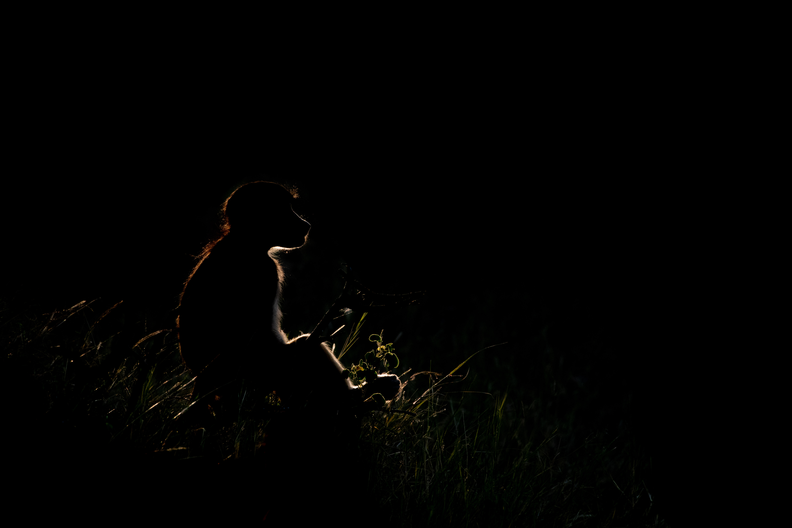

{width="100%"}

**Stoic** — *It was late afternoon on the Chobe and a group of baboons had come down to drink and socialize by the river. The congregated by some bluffs that were very white. I decided to use the white backdrop to create this minimalist portrait that reminds me of a charcoal drawing while keeping amazing detail.*

## Introduction

*Papio ursinus* or the chacma baboon is the only baboon species I have had the pleasure of photographing as they are the only species that occur in Botswana (Hoffmann & Hilton-Taylor, 2008). These primates are a hoot to watch in a group. From juveniles being stinkers and adults just trying to have some peace and quiet, I understand why family get togethers with the kids often end up with someone being put in time-out. A cross species commonality as a way to put it. Of my few encounters, a favorite part was watching them as they came down to the river to drink and groom one another. The babies cradled in their mothers' arms and the big males keeping watch with all of the small social interactions that were just constant organized chaos. I hope to get some more time with groups of baboons as I only had a small number of encounters while in Botswana and none when I was in Kenya. 

{width="100%"}

**Silhouette** — *I had maybe ten seconds to capture this image. The sun had just started to go down behind the trees near the river and through the gaps this beam hit this lone baboon and created this amazing rim lighting. I saw it, shot as many shots as I could and just as quickly as it appeared, the light vanished. I was thrilled to see I had gotten this image especially given the almost pondering way the baboon is sitting.*

## Human-influenced diets affect the gut microbiome of wild baboons. Moy et al., 2023.

Moy et al., explored how access to human diet items in the form of trash affected the microbiome of olive baboons (*Papio anubis*) found within Akagera National Park in Rwanda. Fecal samples were taken from three baboon groups with no access to trash, limited access to trash, and unlimited access to trash. The DNA was extracted from the feces and PCR was used to amplify 16S amplicons for sequencing the bacterial fecal microbiome. It was found that overall diversity of the fecal microbiome of those with unlimited access to trash was lower than both those with limited and no access to trash. This pattern has been observed in other studies of various animal species with one notable study on black bears indicating this is a broader anthropogenic impact on multiple species and not just a few (Gillman et al., 2022).

{width="100%"}

**Mom's Touch** — *The low light of this image made capturing a less noisy image impossible. This was captured late in the afternoon as the sun was setting. This mother and baby were perched on a log as the rest of the troop was running around. The poor baby was so tired and just wanted to sleep as they sat by the water. The black and white rendering helps control the noise a little better and makes it more appealing.* 

## Social networks predict gut microbiome composition in wild baboons. Tung et al., 2015. 

Tung et al., investigated through shotgun metagenomics how social interactions affect the fecal microbiome of yellow baboons (*Papio cynocephalus*) in Amboseli National Park Kenya. Feces was collected, extracted for DNA, and sequenced to allow for the both bacterial identification and understanding the functional genes present in the microbial community. It was found that social group membership and grooming social network had strong correlations with the composition of the microbiome. This not only showed that the overall dissimilarity between those in the same social group and those that groomed one another was lower, but that also the functional genes found in the fecal microbiome were enriched in those that had stronger social interactions within their group indicating that social interactions play a key role in the functional repertoire of the fecal microbiome. 

## References

Gillman, S. J., McKenney, E. A., & Lafferty, D. J. R. (2022). Human-provisioned foods reduce gut microbiome diversity in American black bears (Ursus americanus). Journal of Mammalogy, 103(2), 339–346. https://doi.org/10.1093/jmammal/gyab154

Hoffmann, M., & Hilton-Taylor, C. (2008). Papio ursinus. The IUCN Red List of Threatened Species 2008: e.T16022A5366717. https://dx.doi.org/10.2305/IUCN.UK.2008.RLTS.T16022A5366717.en

Moy, M., Diakiw, L., & Amato, K. R. (2023). Human-influenced diets affect the gut microbiome of wild baboons. Scientific Reports, 13, Article 11886. https://doi.org/10.1038/s41598-023-38895-z

Tung, J., Barreiro, L. B., Burns, M. B., Grenier, J.-C., Lynch, J., Grieneisen, L. E., Altmann, J., Alberts, S. C., Blekhman, R., & Archie, E. A. (2015). Social networks predict gut microbiome composition in wild baboons. eLife, 4, Article e05224. https://doi.org/10.7554/eLife.05224