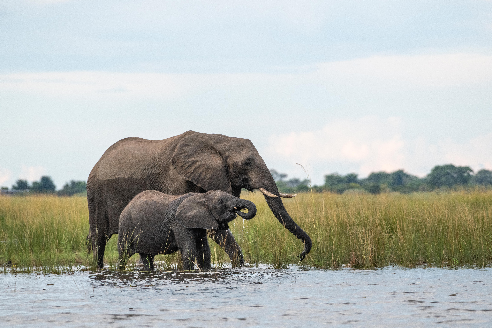

{width="100%"}

**Weathered** — *Docked on the side of the Chobe, this lone bull slowly walked past our boat. I went on the bow and leaned as far as I could to get the head on shot. He came about 20 meters from me and just kept moving down the river indifferent to our presence. This portrait was a shot that I had envisioned for months and was so happy when I had the chance to capture it.*

## Introduction

*Loxodonta africana* is arguably one of the most charismatic megafauna species alive. Elephants have always captivated me since I was young. From the sheer size to the complex social structures, they remind me that we are not the only intelligent species on this earth. In 2023 I went to both Botswana and Kenya. In Chobe National Park near Kasane Botswana, the elephant populations are more tolerant of humans when compared to those of South Africa and eastern Africa. The lack of hunting and human wildlife conflict has allowed for these individuals to be more relaxed around people. This is not to say they are tame as I found out when one of the other boats was charged and tusked by a rogue male. I was informed this one of only a handful of instances of elephants behaving aggressively in this region. My experiences thankfully were not of the terrifying kind. One moment I was unable to photograph was our boat drifting close to an island in the channel of the river. On this island there was a small herd feeding with the matriarch and her calf near the water. I cannot say for certain, but we came within only mere meters of the matriarch. Nothing can describe watching as she flared her ears out and her calf hid behind her. I still get giddy thinking about that moment. Kenya was slightly less magical; however, I cannot understate how incredible being able to create artwork of these animals is.

**Beach Solitude** — *Docked on the side of the Chobe, this lone bull slowly walked past our boat. I went on the bow and leaned as far as I could to get the head on shot. He came about 20 meters from me and just kept moving down the river indifferent to our presence.*
## A metagenomic survey of the fecal microbiome of the African savanna elephant (Loxodonta africana). Preez et al., 2024

The Preez et al., paper investigated the fecal microbiome of semi-captive elephants from South Africa ranging in both age and sex. The DNA from each individual elephant's feces was extracted and 16S rRNA gene and ITS2 were used for PCR to amplify the bacterial/archaeal and fungal components of the fecal microbiome respectively. Sequencing and subsequent analysis of these amplicons allowed the researchers to establish the relative abundance of each major taxa within the fecal microbiome. Subsequent metagenomic shotgun sequencing was performed to determine what functional genes were present that could be attributed to nutrient metabolism and acquisition. From the amplicon analysis, microbial community profiles were obtained providing a baseline characterization of savanna elephant microbiome components. This in of itself is a novel analysis and characterization for the bacterial, archaeal, and fungal communities. The metagenomic analysis showed that the majority of the catabolic pathway genes were associated with carbohydrate degradation. This result is novel yet substantiated by previous research of other hindgut fermenters such as horses and rhinos. Overall, the research provided baseline fecal microbiome profiles as well as an in depth exploration of the various carbohydrate catabolic genes present. 

{width="100%"}

**Flooded Lunch** — *While exploring the Chobe, there were many instances where we came across spread family groups that had crossed the river to access food as can be seen by the high water mark on the mother's side. This cow calf pair were busy munching away at the waterlogged grass. I enjoy being able to sit and enjoy simple moments like foraging.*

{width="100%"}

**Just Like Mom** — *There is a special place in my heart each time we encountered young calves within a group. While the older individuals paid us no mind, the calves always stuck close to mom. It creates wonderful intimate moments. The overexposed vegitation really allows the details both on the cow and the calf to stand out making the image pop.*

## Effects of diet, habitat, and phylogeny on the fecal microbiome of wild African savanna (*Loxodonta africana*) and forest elephants (*L. cyclotis*). Budd et al., 2020

In this study, savanna elephants were sampled from Kenya while forest elephants were sampled from Gabon. Fecal samples were collected and DNA was extracted. Microsatellites were used to determine how many distinct individuals were sampled. Subsequent individuals' fecal extracts were used for 16S rRNA gene metabarcoding to determine the bacterial composition of the fecal community. It was found that the dominant taxa between the two species differed substantially most likely due to the differing diets and environments being occupied. This was also reflected when members of the same species were compared with beta diversity metrics as it was found that microbiome compositions differed most when factored for habitat and diet. These findings are substantiated by the Muegge et al., paper that showed diet is one of the primary drivers in microbiome composition (2011).

{width="100%"}

**Baby of Mine** — *This was an image I did not realize I had shot. Many of the images I show I know when I take the photo it is going to be a good image. This image I found while editing a few months later and when I finished editing it, I cried. Very few of my images move me in that way, but this image with the framing of the baby between the two cows and the trunk reaching up under their mother's jaw, it just moved me. This image has become one of my all time favorites.*

{width="100%"}

**Motion** — *Focusing on part of the whole offers a different perspective. The mud being propelled off of the foot and the swing of the trunk are not a typical image of an elephant yet unmistakably is part of the whole.*

## References 

Budd, K., Gunn, J. C., Finch, T., Klymus, K., Sitati, N., & Eggert, L. S. (2020). Effects of diet, habitat, and phylogeny on the fecal microbiome of wild African savanna (Loxodonta africana) and forest elephants (L. cyclotis). Ecology and evolution, 10(12), 5637–5650. https://doi.org/10.1002/ece3.6305

Du Preez, L. L., van der Walt, E., Valverde, A., Rothmann, C., Neser, F. W. C., & Cason, E. D. (2024). A metagenomic survey of the fecal microbiome of the African savanna elephant (Loxodonta africana). Animal Genetics, 55, 621–643. https://doi.org/10.1111/age.13458

Muegge, B. D., Kuczynski, J., Knights, D., Clemente, J. C., González, A., Fontana, L., Henrissat, B., Knight, R., & Gordon, J. I. (2011). Diet drives convergence in gut microbiome functions across mammalian phylogeny and within humans. Science, 332(6032), 970–974. https://doi.org/10.1126/science.1198719

